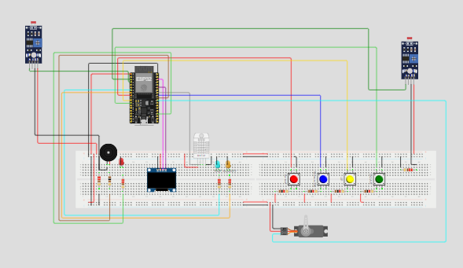

# Medibox IoT Project

Welcome to the Medibox IoT project repository. This project is designed to help users manage their medication schedules effectively using IoT technology.

## Table of Contents
- [Introduction](#introduction)
- [Features](#features)
- [Usage](#usage)
- [Schematics](#schematics)
- [PCB](#PCB)
- [Wokwi simulation](#Wokwi)
- [License](#license)

## Introduction
Medibox is an innovative IoT-based device designed to help users manage their medication schedules effectively and ensure optimal storage conditions for sensitive medicines. By integrating real-time monitoring, automated controls, and a user-friendly interface, Medibox aims to provide a reliable solution for maintaining medication efficacy and compliance.

## Features
- Real-time light intensity monitoring using LDR sensors.
- Dynamic light adjustment with a servo motor to protect light-sensitive medicines.
- Customizable settings for different types of medicines via a user-friendly Node-RED dashboard (Real-Time Visualization).
- The system provides timely alerts and notifications when the storage conditions deviate from the set parameters

## Installation
To install and run this project, the following tools were installed:
- Arduino IDE
- Node-RED
- MQTT broker (e.g., test.mosquitto.org)

## Usage
### 1. Hardware Setup:
   - **Place LDR Sensors:** Position the LDRs on either side of the Medibox.
   - **Connect Servo Motor:** Attach the servo motor to the shaded sliding window.
   - **Power On:** Connect the ESP32 and ensure all components are properly wired.

### 2. Software Installation:
   - **Arduino IDE:** Install and upload the provided code to the ESP32.
   - **Node-RED:** Install Node-RED and import the provided flow JSON file.
   - **MQTT Broker:** Ensure connectivity to a public or private MQTT broker.

### 3. Configure and Operate:
   - **Wi-Fi Setup:** Input your Wi-Fi credentials in the Arduino code.
   - **Dashboard Setup:** Use Node-RED to monitor light intensity and control the shading window.
   - **Adjust Settings:** Use the dashboard sliders to customize the Medibox settings for different medicines.

### Wokwi Simulation
Simulating the Medibox functionality using Wokwi to test and demonstrate its features, including real-time monitoring and alarm settings.

## License
This project is licensed under the MIT License. See the [LICENSE](LICENSE) file for more details.
